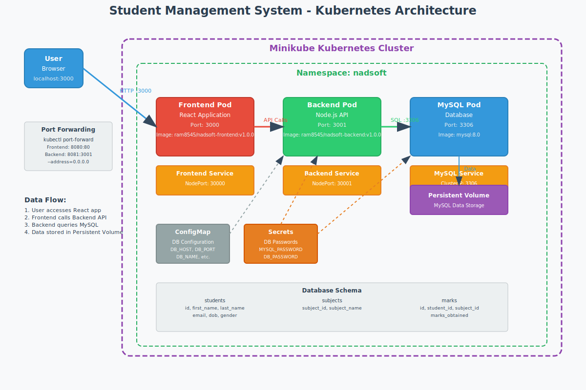

# Nadsoft Student Management System

A full-stack web application for managing student records with CRUD operations, built with React frontend, Node.js backend, and MySQL database.

## 🏗️ System Architecture



### Service Overview
```
┌─────────────────┐    ┌─────────────────┐    ┌─────────────────┐
│   React Frontend│    │ Node.js Backend │    │  MySQL Database │
│    (Port 3000)  │◄──►│   (Port 3001)   │◄──►│   (Port 3306)   │
│                 │    │                 │    │                 │
│ • User Interface│    │ • REST API      │    │ • Data Storage  │
│ • State Mgmt    │    │ • Business Logic│    │ • Relationships │
│ • HTTP Requests │    │ • Data Validation│   │ • Transactions  │
└─────────────────┘    └─────────────────┘    └─────────────────┘
```

### Docker Network Architecture
```
┌──────────────────────────────────────────────────────────────┐
│                    Docker Network                            │
│                  (nadsoft-network)                          │
│                                                             │
│  ┌─────────────┐  ┌─────────────┐  ┌─────────────────────┐  │
│  │  Frontend   │  │  Backend    │  │      MySQL          │  │
│  │ Container   │  │ Container   │  │    Container        │  │
│  │             │  │             │  │                     │  │
│  │ nginx:alpine│  │ node:18     │  │   mysql:8.0         │  │
│  │             │  │             │  │                     │  │
│  └─────┬───────┘  └─────┬───────┘  └─────────┬───────────┘  │
│        │                │                    │             │
└────────┼────────────────┼────────────────────┼─────────────┘
         │                │                    │
         │                │                    │
    ┌────▼────┐      ┌────▼────┐         ┌────▼────┐
    │Port 3000│      │Port 3001│         │Port 3306│
    │  (HTTP) │      │  (API)  │         │  (SQL)  │
    └─────────┘      └─────────┘         └─────────┘
```

## 📋 Prerequisites

Before running this application, make sure you have installed:

- [Docker](https://www.docker.com/get-started) (version 20.10+)
- [Docker Compose](https://docs.docker.com/compose/install/) (version 2.0+)

## 🚀 Quick Start

### 1. Clone the Repository
```bash
git clone <your-repository-url>
cd nadsoft-student-management
```

### 2. Build Docker Images
```bash
# Build frontend image
docker build -t nadsoft-frontend ./frontend

# Build backend image
docker build -t nadsoft-backend ./backend
```

### 3. Start the Application
```bash
# Start all services
docker-compose up -d

# View logs (optional)
docker-compose logs -f
```

### 4. Access the Application
- **Frontend**: http://localhost:3000
- **Backend API**: http://localhost:3001
- **Database**: localhost:3306

### 5. Verify Services are Running
```bash
# Check service status
docker-compose ps

# Expected output:
# NAME               IMAGE               STATUS
# nadsoft-frontend   nadsoft-frontend    Up
# nadsoft-backend    nadsoft-backend     Up
# nadsoft-mysql      mysql:8.0           Up (healthy)
```

## 📁 Project Structure

```
nadsoft-student-management/
├── frontend/                 # React frontend application
│   ├── src/
│   │   ├── components/       # React components
│   │   ├── pages/           # Page components
│   │   ├── services/        # API service functions
│   │   └── App.js           # Main App component
│   ├── public/
│   ├── package.json
│   └── Dockerfile
├── backend/                  # Node.js backend API
│   ├── controllers/         # Route controllers
│   ├── routes/              # API routes
│   ├── middleware/          # Custom middleware
│   ├── db.js               # Database connection
│   ├── server.js           # Express server setup
│   ├── package.json
│   └── Dockerfile
├── docs/                    # Documentation
│   └── images/             # Architecture diagrams
│       └── architecture-diagram.png
├── docker-compose.yml       # Docker Compose configuration
├── .env                     # Environment variables
├── init.sql                 # Database initialization script
└── README.md
```

## 🐳 Docker Services Configuration

### Service Details

| Service | Image | Port | Volume | Health Check |
|---------|-------|------|---------|-------------|
| **Frontend** | `nadsoft-frontend` | 3000:80 | - | HTTP GET / |
| **Backend** | `nadsoft-backend` | 3001:3001 | - | HTTP GET /health |
| **MySQL** | `mysql:8.0` | 3306:3306 | `mysql_data:/var/lib/mysql` | mysqladmin ping |

### Network Configuration
- **Network Name**: `nadsoft-network`
- **Driver**: bridge
- **Internal Communication**: Service discovery by container names

## ⚙️ Configuration

### Environment Variables

The application uses the following environment variables (defined in `.env`):

```env
# Database Configuration
MYSQL_ROOT_PASSWORD=rootpassword
MYSQL_DATABASE=student_db
MYSQL_USER=nadsoft_user
MYSQL_PASSWORD=nadsoft_password

# Backend Configuration
DB_HOST=mysql
DB_PORT=3306
DB_USER=nadsoft_user
DB_PASSWORD=nadsoft_password
DB_NAME=student_db
NODE_ENV=production

# Port Configuration
FRONTEND_PORT=3000
BACKEND_PORT=3001
MYSQL_PORT=3306

# CORS Configuration
CORS_ORIGIN=http://localhost:3000
```

### Database Schema

The application creates the following tables with relationships:

```sql
-- Database: student_db
-- Character Set: utf8mb4
-- Collation: utf8mb4_unicode_ci
```

#### Students Table
```sql
CREATE TABLE students (
  id INT AUTO_INCREMENT PRIMARY KEY,
  first_name VARCHAR(255) NOT NULL,
  last_name VARCHAR(255) NOT NULL,
  email VARCHAR(255) UNIQUE NOT NULL,
  dob DATE,
  gender ENUM('Male', 'Female', 'Other'),
  created_at TIMESTAMP DEFAULT CURRENT_TIMESTAMP,
  updated_at TIMESTAMP DEFAULT CURRENT_TIMESTAMP ON UPDATE CURRENT_TIMESTAMP
);
```

#### Subjects Table
```sql
CREATE TABLE subjects (
  subject_id INT AUTO_INCREMENT PRIMARY KEY,
  subject_name VARCHAR(255) NOT NULL,
  created_at TIMESTAMP DEFAULT CURRENT_TIMESTAMP
);
```

#### Marks Table
```sql
CREATE TABLE marks (
  id INT AUTO_INCREMENT PRIMARY KEY,
  student_id INT,
  subject_id INT,
  marks_obtained INT,
  created_at TIMESTAMP DEFAULT CURRENT_TIMESTAMP,
  FOREIGN KEY (student_id) REFERENCES students(id) ON DELETE CASCADE,
  FOREIGN KEY (subject_id) REFERENCES subjects(subject_id) ON DELETE CASCADE
);
```

### Database Relationships
```
Students (1) ──────── (*) Marks (*) ──────── (1) Subjects
    │                        │                      │
    └── id                   ├── student_id         └── subject_id
                             └── subject_id
```

## 🔧 Docker Commands

### Basic Operations
```bash
# Start all services
docker-compose up -d

# Stop all services
docker-compose down

# View logs
docker-compose logs -f

# View logs for specific service
docker-compose logs -f backend

# Restart a specific service
docker-compose restart backend

# Check service status
docker-compose ps
```

### Development Commands
```bash
# Rebuild images and start
docker-compose up --build -d

# Start services without detached mode (see logs in terminal)
docker-compose up

# Scale a service (if needed)
docker-compose up -d --scale backend=2

# Execute command in running container
docker-compose exec backend npm run test
docker-compose exec mysql mysql -u nadsoft_user -p
```

### Data Management
```bash
# Stop and remove all data (including database)
docker-compose down -v

# Backup database
docker exec nadsoft-mysql mysqldump -u nadsoft_user -pnadsoft_password student_db > backup.sql

# Restore database
docker exec -i nadsoft-mysql mysql -u nadsoft_user -pnadsoft_password student_db < backup.sql

# View database size
docker exec nadsoft-mysql mysql -u nadsoft_user -pnadsoft_password -e "SELECT table_schema AS 'Database', ROUND(SUM(data_length + index_length) / 1024 / 1024, 1) AS 'DB Size in MB' FROM information_schema.tables WHERE table_schema='student_db';"
```

## 🌐 API Endpoints

### Health Check
- `GET /health` - Service health status

### Students API
- `GET /api/students` - Get all students (with pagination)
- `GET /api/students/:id` - Get student by ID (with marks)
- `POST /api/students` - Create new student
- `PUT /api/students/:id` - Update student
- `DELETE /api/students/:id` - Delete student

### Subjects API
- `GET /api/subjects` - Get all subjects
- `POST /api/subjects` - Create new subject

### Marks API
- `GET /api/marks/student/:id` - Get marks for a student
- `POST /api/marks` - Add marks for a student

### Query Parameters for GET /api/students
- `page` - Page number (default: 1)
- `limit` - Items per page (default: 10)
- `search` - Search by name or email
- `sortBy` - Sort field (first_name, last_name, email, created_at)
- `sortOrder` - Sort direction (asc, desc)

### Request Body Examples

#### Create/Update Student (POST/PUT)
```json
{
  "first_name": "John",
  "last_name": "Doe",
  "email": "john.doe@example.com",
  "dob": "2000-01-15",
  "gender": "Male"
}
```

#### Create Subject (POST)
```json
{
  "subject_name": "Mathematics"
}
```

#### Add Marks (POST)
```json
{
  "student_id": 1,
  "subject_id": 1,
  "marks_obtained": 85
}
```

### API Response Examples

#### Success Response
```json
{
  "success": true,
  "data": {
    "id": 1,
    "first_name": "John",
    "last_name": "Doe",
    "email": "john.doe@example.com",
    "dob": "2000-01-15",
    "gender": "Male",
    "created_at": "2025-01-01T10:00:00.000Z"
  },
  "message": "Student created successfully"
}
```

#### Error Response
```json
{
  "success": false,
  "error": "Email already exists",
  "message": "A student with this email already exists"
}
```

## 🔍 Troubleshooting

### Common Issues

1. **Port already in use**
   ```bash
   # Check what's using the port
   lsof -i :3000
   lsof -i :3001
   lsof -i :3306

   # Kill the process or change ports in docker-compose.yml
   sudo kill -9 $(lsof -t -i:3000)
   ```

2. **Database connection failed**
   ```bash
   # Check MySQL container logs
   docker-compose logs mysql

   # Restart MySQL service
   docker-compose restart mysql

   # Check if MySQL is accepting connections
   docker-compose exec mysql mysqladmin -u nadsoft_user -pnadsoft_password ping
   ```

3. **Backend can't connect to database**
   ```bash
   # Check if services are on the same network
   docker network ls
   docker network inspect nadsoft-student-management_nadsoft-network

   # Test connection from backend container
   docker-compose exec backend ping mysql
   ```

4. **Frontend can't reach backend**
   - Ensure backend URL in frontend code points to `http://localhost:3001`
   - Check if backend service is running: `docker-compose ps`
   - Verify CORS configuration in backend

5. **Docker build issues**
   ```bash
   # Clean Docker cache
   docker system prune -a

   # Rebuild without cache
   docker-compose build --no-cache
   ```

### Debugging Commands
```bash
# Enter MySQL container
docker exec -it nadsoft-mysql mysql -u nadsoft_user -pnadsoft_password

# Enter backend container
docker exec -it nadsoft-backend sh

# Enter frontend container
docker exec -it nadsoft-frontend sh

# Check container resource usage
docker stats

# Inspect container configuration
docker inspect nadsoft-backend

# View container filesystem
docker exec nadsoft-backend ls -la /app
```

### Service Health Monitoring
```bash
# Check all services health
docker-compose ps

# Test backend API health
curl http://localhost:3001/health

# Test frontend accessibility
curl -I http://localhost:3000

# Test database connectivity
docker-compose exec backend node -e "const mysql = require('mysql2'); const db = mysql.createConnection({host: 'mysql', user: 'nadsoft_user', password: 'nadsoft_password', database: 'student_db'}); db.connect((err) => { if(err) console.log('Failed:', err.message); else console.log('Connected!'); db.end(); });"
```

## 🧪 Testing

### Manual Testing
1. Access frontend at http://localhost:3000
2. Test CRUD operations through the UI:
   - Create new students
   - View student list with pagination
   - Edit student information
   - Delete students
   - Add and view marks

### API Testing with curl

```bash
# Health check
curl http://localhost:3001/health

# Get all students
curl http://localhost:3001/api/students

# Create a student
curl -X POST http://localhost:3001/api/students \
  -H "Content-Type: application/json" \
  -d '{"first_name":"Jane","last_name":"Smith","email":"jane@example.com","dob":"1999-05-20","gender":"Female"}'

# Get student by ID
curl http://localhost:3001/api/students/1

# Update student
curl -X PUT http://localhost:3001/api/students/1 \
  -H "Content-Type: application/json" \
  -d '{"first_name":"Jane","last_name":"Doe","email":"jane.doe@example.com","dob":"1999-05-20","gender":"Female"}'

# Delete student
curl -X DELETE http://localhost:3001/api/students/1

# Search students
curl "http://localhost:3001/api/students?search=jane&page=1&limit=5"
```

### API Testing with Postman
Import the following collection URL:
```
postman_collection.json (create and place in docs folder)
```

## 📊 Monitoring & Performance

### Health Checks
All services include health checks:

```yaml
# MySQL Health Check
healthcheck:
  test: ["CMD", "mysqladmin", "ping", "-h", "localhost", "-u", "nadsoft_user", "-pnadsoft_password"]
  timeout: 20s
  retries: 10

# Backend Health Check
healthcheck:
  test: ["CMD", "curl", "-f", "http://localhost:3001/health"]
  interval: 30s
  timeout: 10s
  retries: 3
```

### Performance Monitoring
```bash
# Monitor resource usage
docker stats --format "table {{.Container}}\t{{.CPUPerc}}\t{{.MemUsage}}\t{{.NetIO}}\t{{.BlockIO}}"

# Database performance
docker exec nadsoft-mysql mysql -u nadsoft_user -pnadsoft_password -e "SHOW PROCESSLIST;"

# Check slow queries
docker exec nadsoft-mysql mysql -u nadsoft_user -pnadsoft_password -e "SELECT * FROM information_schema.processlist WHERE time > 1;"
```

### Logs Management
```bash
# View all logs with timestamps
docker-compose logs -t

# Follow logs in real-time with limited lines
docker-compose logs -f --tail=100

# Logs for specific service
docker-compose logs -f backend --tail=50

# Save logs to file
docker-compose logs > application.log

# Rotate logs (if getting too large)
docker-compose down && docker-compose up -d
```

## 🔄 Updates and Maintenance

### Updating the Application
1. **Pull latest changes**
   ```bash
   git pull origin main
   ```

2. **Rebuild and restart services**
   ```bash
   docker-compose down
   docker-compose build --no-cache
   docker-compose up -d
   ```

3. **Verify updates**
   ```bash
   docker-compose ps
   curl http://localhost:3001/health
   ```

### Database Migrations
For schema changes:

1. **Backup current data**
   ```bash
   docker exec nadsoft-mysql mysqldump -u nadsoft_user -pnadsoft_password student_db > backup_$(date +%Y%m%d_%H%M%S).sql
   ```

2. **Update init.sql with new schema**

3. **Apply migrations** (for production, use proper migration scripts)
   ```bash
   docker-compose down -v  # WARNING: This removes all data
   docker-compose up -d
   ```

### Regular Maintenance Tasks

**Weekly:**
```bash
# Check disk usage
docker system df

# Clean unused images
docker image prune -f

# Backup database
./scripts/backup_database.sh  # Create this script
```

**Monthly:**
```bash
# Full system cleanup
docker system prune -a --volumes

# Update base images
docker-compose pull
docker-compose up -d
```

### Scaling Considerations

For production deployment:
- Use external MySQL service (AWS RDS, Google Cloud SQL)
- Implement load balancer for multiple backend instances
- Use Redis for session management
- Set up proper logging (ELK stack)
- Implement monitoring (Prometheus + Grafana)

## 🚀 Deployment

### Production Deployment Checklist

- [ ] Update environment variables for production
- [ ] Configure reverse proxy (nginx)
- [ ] Set up SSL certificates
- [ ] Configure backup strategy
- [ ] Set up monitoring and alerting
- [ ] Configure log rotation
- [ ] Test disaster recovery procedures

### Docker Production Compose
Create `docker-compose.prod.yml`:
```yaml
version: '3.8'
services:
  frontend:
    build: ./frontend
    restart: unless-stopped
    environment:
      - NODE_ENV=production
  backend:
    build: ./backend
    restart: unless-stopped
    environment:
      - NODE_ENV=production
  mysql:
    image: mysql:8.0
    restart: unless-stopped
    environment:
      - MYSQL_ROOT_PASSWORD=${MYSQL_ROOT_PASSWORD}
    volumes:
      - /var/lib/mysql:/var/lib/mysql
```

## 🤝 Contributing

1. Fork the repository
2. Create a feature branch (`git checkout -b feature/amazing-feature`)
3. Commit your changes (`git commit -m 'Add some amazing feature'`)
4. Push to the branch (`git push origin feature/amazing-feature`)
5. Open a Pull Request

### Development Setup
```bash
# Clone your fork
git clone https://github.com/yourusername/nadsoft-student-management.git

# Create development branch
git checkout -b development

# Start development environment
docker-compose -f docker-compose.dev.yml up -d
```

## 📄 Documentation

- [API Documentation](./docs/API.md)
- [Frontend Components](./docs/FRONTEND.md)
- [Database Schema](./docs/DATABASE.md)
- [Deployment Guide](./docs/DEPLOYMENT.md)

## 📝 License

This project is licensed under the MIT License - see the [LICENSE](LICENSE) file for details.

---

---

**Made with ❤️ by ram8545**
